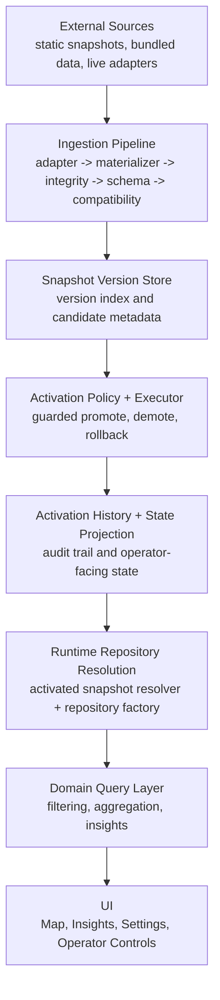

# Flow Architecture Overview

Flow uses a snapshot-first data architecture where external mobility datasets are ingested, validated, versioned, and activated through a guarded operator-safe activation workflow before they are consumed by runtime query systems.

The system is designed to keep runtime map, insights, and settings experiences insulated from unstable external APIs. Live-capable data sources are never queried directly at render time. Instead, Flow materializes source data into validated snapshots, stores those versions, and exposes only activation-approved snapshots to runtime data access.

This document is the canonical architectural reference for the repository as of Phase 4 completion.

## System Boundaries

Flow currently supports a mixed-source environment:
- Static bundled sample data for safe baseline behavior
- Snapshot-backed regional and national datasets
- Live-capable sources that ingest into the snapshot pipeline before activation
- Operator-controlled activation workflows layered on top of existing runtime repository resolution

Stable static paths remain first-class and backward compatible:
- `bundledSample`
- `seoulCapitalSnapshot`
- `koreaNational`

## Architecture Layers

### External Source Layer

Purpose:
Provide raw dataset inputs to the system, whether static, bundled, snapshot-backed, or live-capable.

Current source categories:
- `bundledSample`
- `seoulCapitalSnapshot`
- `koreaNational`
- live external adapters such as the Seoul live-capable adapter path

Responsibilities:
- expose source identity
- provide static packaged resources or adapter-driven payloads
- remain isolated from runtime query/render logic

Key principle:
External source details must not leak into domain query or visualization paths.

### Ingestion Pipeline Layer

Purpose:
Normalize external data into Flow-compatible snapshots and prevent invalid or unstable data from becoming activatable runtime inputs.

Primary components:
- `ExternalDatasetAdapter`
- `SnapshotMaterializer`
- `SnapshotIntegrityChecker`
- `DatasetSchemaValidator`
- `DatasetCompatibilityChecker`
- `IngestionPipelineCoordinator`

Responsibilities:
- fetch or receive external dataset payloads
- normalize payload structure
- materialize snapshot files and contracts
- verify file completeness and checksums
- validate schema compliance
- evaluate compatibility with current Flow expectations
- classify ingestion outcomes before version storage

Key principle:
The ingestion boundary is the only place where unstable external dataset structure is allowed.

### Versioning & Activation Layer

Purpose:
Maintain versioned snapshot state, evaluate activation eligibility, preserve last-known-good snapshots, and record operator-safe activation history.

Primary components:
- `DatasetVersionStore`
- manifest index structures inside the version store layer
- `SnapshotActivationPolicy`
- `SnapshotActivationExecutor`
- `SnapshotActivationHistoryStore`
- `SnapshotActivationStateProjector`

Responsibilities:
- store snapshot versions by source, snapshot ID, and dataset version
- keep source-scoped candidate ordering and lookup
- evaluate whether a candidate can be activated
- preserve current active and last-known-good state
- execute guarded promote, demote, and rollback transitions
- record requested and terminal activation events
- project operator-facing activation state from policy state plus history

Key principle:
Activation is explicit, guarded, source-scoped, and auditable.

### Runtime Data Access Layer

Purpose:
Resolve the correct dataset source at runtime and keep data loading compatible with both static and activation-aware source paths.

Primary components:
- DTOs
- mappers
- data sources
- `MobilityRepositoryFactory`
- `ActivatedSnapshotResolver`

Responsibilities:
- decode source-specific data formats into canonical models
- translate DTOs to domain entities
- provide repository-backed access to active dataset content
- resolve activated snapshots for live-capable sources
- fall back safely to stable packaged snapshot paths when no active live snapshot is available

Key principle:
Runtime repository resolution must remain safe even when activation state is missing, incomplete, or ineligible.

### Domain Query Layer

Purpose:
Turn loaded datasets into queryable mobility intelligence used by map rendering, insights, and analytics features.

Primary components:
- `MobilityQuery`
- filtering engine
- spatial aggregation engine
- guardrail policy
- insights use cases

Responsibilities:
- define source-agnostic query contracts
- filter by mode, geography, and thresholds
- aggregate flows spatially and temporally
- enforce rendering/query guardrails
- support insights and higher-level analytical summaries

Key principle:
Domain query logic stays independent of raw provider details and activation command mechanics.

### Metadata & Enrichment Layer

Purpose:
Expose operational source state to UI and operator tooling without forcing views to reconstruct lifecycle state manually.

Primary components:
- `DatasetRefreshStateStore`
- `CatalogLiveMetadataEnricher`
- `DatasetLiveMetadata`
- `DatasetActivationMetadata`

Responsibilities:
- track refresh attempts and outcomes
- expose candidate readiness and compatibility hints
- expose active snapshot, last-known-good, and rollback readiness
- enrich source descriptors with operational activation metadata
- provide source-scoped metadata for settings and operator surfaces

Key principle:
Operational state is exposed through enriched metadata, not recomputed ad hoc in the UI.

### Operator Control Layer

Purpose:
Provide a minimal, operator-safe activation surface for inspecting activation state and executing guarded snapshot transitions.

Primary components:
- `SettingsView` -> Operator Controls section
- promote / demote / rollback actions
- action-specific confirmation flows
- recent activity timeline

Responsibilities:
- show active snapshot, last-known-good snapshot, and latest candidate
- expose source-scoped activation status and rollback readiness
- route actions through existing command, guard, and executor layers
- require explicit confirmation for risky transitions
- present recent activation history in a compact operator timeline

Key principle:
Operator UI must remain thin, truthful, and service-driven.

## Visual Architecture Diagram

## Key Architecture Principles

### Snapshot-First Data Architecture

External data must be materialized into Flow snapshots before runtime use.

Implications:
- external APIs are ingestion-time concerns only
- runtime map and insights queries never depend directly on live upstream responses
- static and live-capable sources share a common snapshot consumption model

### Validation Before Activation

A snapshot candidate must pass all required validation gates before it can be treated as activation-ready.

Required gates:
- integrity checks
- schema validation
- compatibility checks

Implications:
- incomplete packages are rejected early
- incompatible schema changes are blocked before activation
- operator workflows only act on known classified candidates

### Versioned Dataset Lifecycle

Every snapshot is versioned and indexed.

Lifecycle concepts:
- `snapshotID`
- `datasetVersion`
- `schemaVersion`
- generated timestamp
- source identity
- activation eligibility
- compatibility classification

Implications:
- stored candidates remain discoverable even when not activatable
- latest version and specific version lookup are deterministic
- rollback and last-known-good semantics are possible because historical versions are preserved

### Operator-Safe Activation

Activation state changes are never implicit.

Rules:
- activation commands are validated first
- guard decisions classify actions as allowed, requires confirmation, blocked, or no-op
- risky transitions require explicit operator confirmation
- successful transitions are recorded in activation history
- rollback is explicit and source-scoped

Implications:
- operator workflows are auditable
- blocked, failed, and no-op actions do not mutate state incorrectly
- last-known-good preservation is part of the activation layer, not an afterthought

### Source Isolation

All ingestion, activation, history, metadata, and runtime resolution operations are scoped per dataset source.

Implications:
- actions on Seoul live-capable sources do not affect `bundledSample`
- Seoul activation state does not pollute `koreaNational`
- history, projection, enrichment, and UI remain source-scoped

### Backward Compatibility

Legacy and stable snapshot-backed paths remain supported and safe.

Protected paths:
- `bundledSample`
- `seoulCapitalSnapshot`
- `koreaNational`

Implications:
- static runtime behavior remains valid even with Phase 3 and Phase 4 activation infrastructure present
- non-live sources do not show bogus live controls or activation metadata
- fallback-to-stable behavior remains part of the runtime repository resolution contract

## Activation Lifecycle

The current activation lifecycle is:

`external dataset`
-> `ingestion`
-> `snapshot materialization`
-> `validation gates`
-> `version store`
-> `activation policy`
-> `operator confirmation`
-> `activation executor`
-> `audit history`
-> `projected activation state`
-> `runtime query consumption`

Expanded flow:
1. An external source produces a static payload or adapter-normalized payload.
2. The ingestion pipeline materializes a Flow snapshot contract and required files.
3. Integrity, schema, and compatibility checks classify the candidate.
4. A successful candidate is stored in the dataset version store.
5. The activation policy evaluates whether the candidate is eligible for activation.
6. Operator-facing metadata surfaces candidate status and confirmation requirements.
7. A promote, demote, or rollback command is validated and guard-evaluated.
8. The activation executor applies safe state mutation only when the command is valid and permitted.
9. Requested and terminal history events are recorded in the activation history store.
10. The activation state projector combines current policy state, history, and candidate metadata into a stable operator-facing view.
11. Runtime repository resolution consumes the currently active snapshot when appropriate, otherwise falls back to stable static paths.

## Runtime Resolution Model

Runtime consumption is intentionally separated from operator workflow details.

Rules:
- live-capable sources may resolve to an activated snapshot version
- if no valid active snapshot exists, runtime access falls back to the stable packaged source path
- static sources ignore activation metadata entirely
- repository and query architecture remain DTO -> Mapper -> DataSource -> Repository based

This separation is what allows Phase 4 activation workflows to coexist with stable static dataset behavior.

## Audit and Operator State Model

Activation history and projected state serve different roles:

Activation history:
- records requested and terminal events
- provides command ID, source, snapshot, and result linkage
- supports operator timeline visibility and future audit storage

Projected activation state:
- is a derived view, not the authoritative mutation source
- combines current activation policy state with history and candidate/version metadata
- drives operator-facing summaries such as active snapshot, rollback readiness, and recent action outcomes

This distinction should remain stable in future phases.

## Stable Reference Components

The following areas are intended to remain the main architectural reference points:
- `Flow/Data/Snapshot/*` for ingestion, versioning, activation, history, and projection
- `Flow/Data/Repositories/*` for repository resolution and metadata enrichment
- `Flow/Domain/Models/*` for source, live, and activation metadata contracts
- `Flow/Features/Settings/*` for the minimal operator-safe UI surface

Future changes should prefer extending these seams rather than introducing parallel activation or metadata systems.

# Future Evolution (Phase 5)

Possible Phase 5 directions:
- persistent audit/history storage
- richer operator dashboard and activation visibility
- activation approval workflows
- operational observability and telemetry
- production-safe activation rollout controls
- optional multi-operator workflows

Phase 5 should extend the current command, policy, projection, enrichment, and operator-control seams rather than replacing them.
